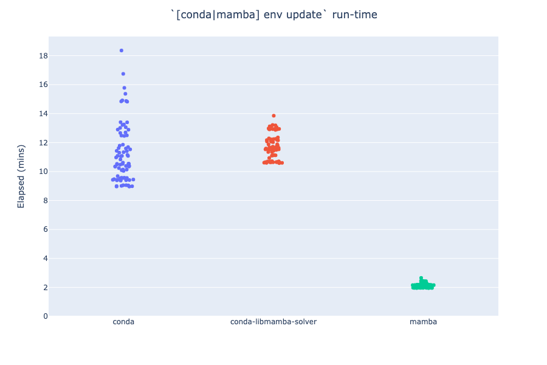

# Compare `mamba` CLI to `conda` (with and without `conda-libmamba-solver`)

Elapsed time to run `[conda|mamba] env update -n base -f environment.yml`, with the same [`environment.yml`](environment.yml)
), and each of these three Dockerfiles:
- [`mamba-cli.dockerfile`](mamba-cli.dockerfile): install `mamba` CLI, use that to update environment
  - `conda install … mamba`
  - `mamba env update …`
- [`mamba-solver.dockerfile`](mamba-solver.dockerfile): install+configure `conda-libmamba-solver`, use `conda` to update environment
  - `conda install … conda-libmamba-solver`
  - `conda config --set solver libmamba`
  - `conda env update …`
- [`conda.dockerfile`](conda.dockerfile): plain `conda env update` (no special configuration)



Times come from [these][mamba run] [two][conda run] GitHub Actions runs.
- `mamba` CLI finishes in ≈2mins
- `conda` with `conda-libmamba-solver` takes 10-12mins, failed 2 of 5 times
  - In the failures, something goes wrong during the initial `conda install … conda-libmamba-solver`
  - subsequent `conda env update` call prints this before failing ([GHA link](https://github.com/runsascoded/libmamba-solver-test/actions/runs/4969272579/jobs/8892339145#step:3:499)):
    ```
    Could not load conda plugin `conda-libmamba-solver`:
    
    libarchive.so.19: cannot open shared object file: No such file or directory
    Could not load conda plugin `conda-libmamba-solver`:
    
    libarchive.so.19: cannot open shared object file: No such file or directory
    Will remove 1 package cache(s).
    ```


### `diff conda.dockerfile mamba-solver.dockerfile`
```diff
18c18,19
< RUN time conda install -q -y -n base -c conda-forge conda==23.3.1 python==3.9.12 \
---
> RUN time conda install -q -y -n base -c conda-forge conda==23.3.1 python==3.9.12 conda-libmamba-solver \
>  && conda config --set solver libmamba \
```

### `diff conda.dockerfile mamba-cli.dockerfile`
```diff
18c18
< RUN time conda install -q -y -n base -c conda-forge conda==23.3.1 python==3.9.12 \
---
> RUN time conda install -q -y -n base -c conda-forge conda==23.3.1 python==3.9.12 mamba \
22c22
< RUN time conda env update -q -v -n base
---
> RUN time mamba env update -q -v -n base
```

[mamba run]: https://github.com/runsascoded/libmamba-solver-test/actions/runs/4969272579/jobs/8892339175
[conda run]: https://github.com/runsascoded/libmamba-solver-test/actions/runs/4969923328/jobs/8893463722
