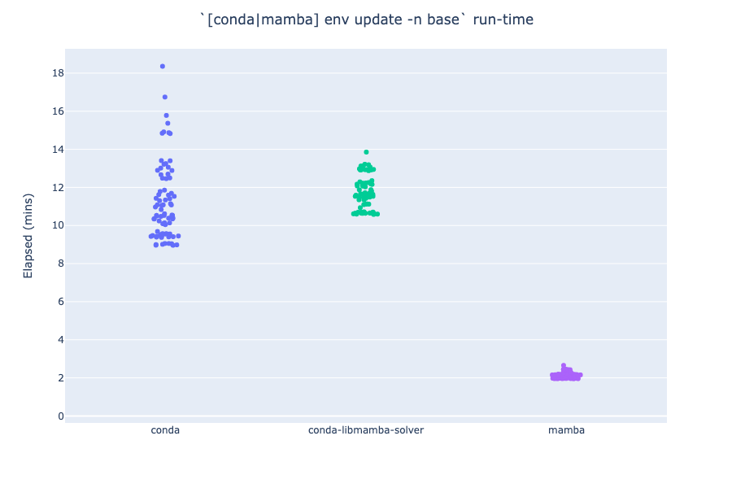
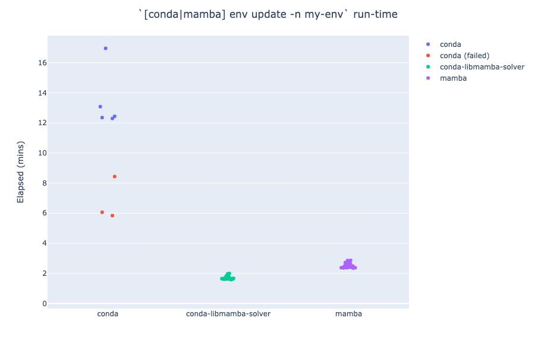

# `conda` (`classic`/`libmamba` solvers) vs. `mamba`

`conda-libmamba-solver` seems to be ≈5x slower than `mamba` when installing [`environment.yml`] into the `base` environment:

<a id="plot-base"></a>


On the other hand, `conda-libmamba-solver` seems to be 30% **faster** than `mamba` when installing [`environment.yml`] into a non-`base` environment:


Notes:
- Data above
[comes][mamba run]
[from][conda run]
[these][combined run]
[eight][combined run - ubuntu]
[runs][conda-only defaults run]
[in][combined run - simplified setup]
[GitHub][combined run - simplified + 5x4x3]
[Actions][new env run];
see [build-times.ipynb](build-times.ipynb)
  - Commits prior to (and including) [`f7c0ba5`](https://github.com/runsascoded/libmamba-solver-test/commit/f7c0ba5) perform the `env update` in the `base` env, generating the timings displayed in the first plot above (where `conda-libmamba-solver` is slow).
  - After `f7c0ba5`, the `env update`s create a new env called `my-env`, and `conda-libmamba-solver` is fast as expected.
- re: the failures in the above plots:
  - The `conda-libmamba-solver` failures in the first plot were due to a corrupt install when `-c conda-forge` is passed (see [discussion below](#conda-forge-failures)).
  - The `conda` failures in the second plot [seem like OOMs in GitHub Actions][new env conda failures]?


## Dockerfiles
The above plots use three similar Dockerfiles:
- [`conda.dockerfile`](conda.dockerfile): plain `conda env update` (no special configuration)
- [`conda-libmamba-solver.dockerfile`](conda-libmamba-solver.dockerfile): install+configure `conda-libmamba-solver`, use `conda` to update environment
  - `conda install … -n base conda-libmamba-solver`
  - `conda config --set solver libmamba`
  - `conda env update -n my-env`
- [`mamba.dockerfile`](mamba.dockerfile): install `mamba` CLI, use that to update environment
  - `conda install … -n base -c conda-forge mamba`
  - `mamba env update -n my-env`

Diffs between the Dockerfiles:
<details><summary><code>diff conda.dockerfile conda-libmamba-solver.dockerfile</code></summary>

```diff
17a18,21
> RUN time conda install -q -y -n base conda-libmamba-solver \
>  && conda config --set solver libmamba \
>  && conda clean -afy
>
```
</details>

<details><summary><code>diff conda.dockerfile mamba.dockerfile</code></summary>

```diff
17a18,20
> RUN time conda install -q -y -n base -c conda-forge mamba \
>  && conda clean -afy
>
19c22
< RUN time conda env update -q -v -n base
---
> RUN time mamba env update -q -v -n base
```
</details>

## Discussion
I thought `conda` with `conda-libmamba-solver` would be a drop-in replacement for the `mamba` CLI. However, I'm seeing `conda-libmamba-solver` take ≈5x as long to solve [`environment.yml`] as the `mamba` CLI (≈2mins vs. 10-14mins), *when installing into the `base` environment*. When installing in a fresh environment (`my-env`, in these examples), `conda-libmamba-solver` is ≈30% faster than `mamba`.

### Verifying `conda-libmamba-solver` installation/configuration
I believe `conda-libmamba-solver` is installed and configured correctly. I followed the instructions in [the launch blog post][conda-libmamba-solver blog] and ["Getting Started" guide][conda-libmamba-solver getting-started]:
```Dockerfile
RUN time conda install -q -y -n base conda-libmamba-solver \
 && conda config --set solver libmamba \
 && conda clean -afy
```
(cf. [`conda-libmamba-solver.dockerfile#L18-20`](./conda-libmamba-solver.dockerfile#L18-20))

#### `conda-libmamba-solver` version emits `libmamba` blocks every 10s
The `conda-libmamba-solver` version appears to be using `libmamba`, as expected. Most of the elapsed time (in the slow runs, installing into the `base` env) is spent outputting blocks like this, every 10s ([example][combined run conda-libmamba-solver job 1]):
<details><summary><code>2023-05-14T03:52:49</code> (215 lines)</summary>

```
Solving environment: ...working... info libmamba Parsing MatchSpec pkgs/main/linux-64::python==3.9.12=h12debd9_1
info libmamba Parsing MatchSpec conda-forge/linux-64::conda==23.3.1=py39hf3d152e_0
info libmamba Parsing MatchSpec pkgs/main/linux-64::setuptools==65.6.3=py39h06a4308_0
info libmamba Parsing MatchSpec pkgs/main/linux-64::pip==23.0.1=py39h06a4308_0
info libmamba Parsing MatchSpec pkgs/main/linux-64::wheel==0.38.4=py39h06a4308_0
info libmamba Parsing MatchSpec pkgs/main/linux-64::conda-content-trust==0.1.3=py39h06a4308_0
info libmamba Parsing MatchSpec conda-forge/noarch::conda-libmamba-solver==23.3.0=pyhd8ed1ab_0
info libmamba Parsing MatchSpec pkgs/main/linux-64::openssl==1.1.1t=h7f8727e_0
info libmamba Parsing MatchSpec conda-forge/noarch::certifi==2023.5.7=pyhd8ed1ab_0
info libmamba Parsing MatchSpec conda-forge/linux-64::ca-certificates==2023.5.7=hbcca054_0
info libmamba Parsing MatchSpec python==3.9.12
info libmamba Parsing MatchSpec python==3.9.12
info libmamba Parsing MatchSpec conda-forge/linux-64::conda==23.3.1=py39hf3d152e_0
info libmamba Parsing MatchSpec conda-forge/linux-64::conda==23.3.1=py39hf3d152e_0
info libmamba Parsing MatchSpec pkgs/main/linux-64::setuptools==65.6.3=py39h06a4308_0
info libmamba Parsing MatchSpec pkgs/main/linux-64::setuptools==65.6.3=py39h06a4308_0
info libmamba Parsing MatchSpec pkgs/main/linux-64::pip==23.0.1=py39h06a4308_0
info libmamba Parsing MatchSpec pkgs/main/linux-64::pip==23.0.1=py39h06a4308_0
info libmamba Parsing MatchSpec pkgs/main/linux-64::wheel==0.38.4=py39h06a4308_0
info libmamba Parsing MatchSpec pkgs/main/linux-64::wheel==0.38.4=py39h06a4308_0
info libmamba Parsing MatchSpec pkgs/main/linux-64::conda-content-trust==0.1.3=py39h06a4308_0
info libmamba Parsing MatchSpec pkgs/main/linux-64::conda-content-trust==0.1.3=py39h06a4308_0
info libmamba Parsing MatchSpec conda-forge/noarch::conda-libmamba-solver==23.3.0=pyhd8ed1ab_0
info libmamba Parsing MatchSpec conda-forge/noarch::conda-libmamba-solver==23.3.0=pyhd8ed1ab_0
info libmamba Parsing MatchSpec openssl
info libmamba Parsing MatchSpec openssl
info libmamba Parsing MatchSpec certifi
info libmamba Parsing MatchSpec certifi
info libmamba Parsing MatchSpec ca-certificates
info libmamba Parsing MatchSpec ca-certificates
info libmamba Parsing MatchSpec pkgs/main/linux-64::urllib3==1.26.15=py39h06a4308_0
info libmamba Parsing MatchSpec pkgs/main/linux-64::urllib3==1.26.15=py39h06a4308_0
info libmamba Parsing MatchSpec pkgs/main/linux-64::libgcc-ng==11.2.0=h1234567_1
info libmamba Parsing MatchSpec pkgs/main/linux-64::libgcc-ng==11.2.0=h1234567_1
info libmamba Parsing MatchSpec pkgs/main/noarch::jsonpointer==2.1=pyhd3eb1b0_0
info libmamba Parsing MatchSpec pkgs/main/noarch::jsonpointer==2.1=pyhd3eb1b0_0
info libmamba Parsing MatchSpec pkgs/main/linux-64::xz==5.2.10=h5eee18b_1
info libmamba Parsing MatchSpec pkgs/main/linux-64::xz==5.2.10=h5eee18b_1
info libmamba Parsing MatchSpec pkgs/main/linux-64::requests==2.28.1=py39h06a4308_1
info libmamba Parsing MatchSpec pkgs/main/linux-64::requests==2.28.1=py39h06a4308_1
info libmamba Parsing MatchSpec pkgs/main/linux-64::packaging==23.0=py39h06a4308_0
info libmamba Parsing MatchSpec pkgs/main/linux-64::packaging==23.0=py39h06a4308_0
info libmamba Parsing MatchSpec pkgs/main/linux-64::brotlipy==0.7.0=py39h27cfd23_1003
info libmamba Parsing MatchSpec pkgs/main/linux-64::brotlipy==0.7.0=py39h27cfd23_1003
info libmamba Parsing MatchSpec pkgs/main/linux-64::conda-package-handling==2.0.2=py39h06a4308_0
info libmamba Parsing MatchSpec pkgs/main/linux-64::conda-package-handling==2.0.2=py39h06a4308_0
info libmamba Parsing MatchSpec pkgs/main/linux-64::tk==8.6.12=h1ccaba5_0
info libmamba Parsing MatchSpec pkgs/main/linux-64::tk==8.6.12=h1ccaba5_0
info libmamba Parsing MatchSpec pkgs/main/linux-64::ruamel.yaml.clib==0.2.6=py39h5eee18b_1
info libmamba Parsing MatchSpec pkgs/main/linux-64::ruamel.yaml.clib==0.2.6=py39h5eee18b_1
info libmamba Parsing MatchSpec pkgs/main/linux-64::libstdcxx-ng==11.2.0=h1234567_1
info libmamba Parsing MatchSpec pkgs/main/linux-64::libstdcxx-ng==11.2.0=h1234567_1
info libmamba Parsing MatchSpec pkgs/main/linux-64::libgomp==11.2.0=h1234567_1
info libmamba Parsing MatchSpec pkgs/main/linux-64::libgomp==11.2.0=h1234567_1
info libmamba Parsing MatchSpec pkgs/main/linux-64::ld_impl_linux-64==2.38=h1181459_1
info libmamba Parsing MatchSpec pkgs/main/linux-64::ld_impl_linux-64==2.38=h1181459_1
info libmamba Parsing MatchSpec pkgs/main/linux-64::pysocks==1.7.1=py39h06a4308_0
info libmamba Parsing MatchSpec pkgs/main/linux-64::pysocks==1.7.1=py39h06a4308_0
info libmamba Parsing MatchSpec pkgs/main/linux-64::pycosat==0.6.4=py39h5eee18b_0
info libmamba Parsing MatchSpec pkgs/main/linux-64::pycosat==0.6.4=py39h5eee18b_0
info libmamba Parsing MatchSpec pkgs/main/noarch::pycparser==2.21=pyhd3eb1b0_0
info libmamba Parsing MatchSpec pkgs/main/noarch::pycparser==2.21=pyhd3eb1b0_0
info libmamba Parsing MatchSpec pkgs/main/linux-64::ncurses==6.4=h6a678d5_0
info libmamba Parsing MatchSpec pkgs/main/linux-64::ncurses==6.4=h6a678d5_0
info libmamba Parsing MatchSpec pkgs/main/linux-64::idna==3.4=py39h06a4308_0
info libmamba Parsing MatchSpec pkgs/main/linux-64::idna==3.4=py39h06a4308_0
info libmamba Parsing MatchSpec pkgs/main/linux-64::_libgcc_mutex==0.1=main
info libmamba Parsing MatchSpec pkgs/main/linux-64::_libgcc_mutex==0.1=main
info libmamba Parsing MatchSpec pkgs/main/noarch::charset-normalizer==2.0.4=pyhd3eb1b0_0
info libmamba Parsing MatchSpec pkgs/main/noarch::charset-normalizer==2.0.4=pyhd3eb1b0_0
info libmamba Parsing MatchSpec pkgs/main/linux-64::zlib==1.2.13=h5eee18b_0
info libmamba Parsing MatchSpec pkgs/main/linux-64::zlib==1.2.13=h5eee18b_0
info libmamba Parsing MatchSpec pkgs/main/linux-64::toolz==0.12.0=py39h06a4308_0
info libmamba Parsing MatchSpec pkgs/main/linux-64::toolz==0.12.0=py39h06a4308_0
info libmamba Parsing MatchSpec pkgs/main/linux-64::_openmp_mutex==5.1=1_gnu
info libmamba Parsing MatchSpec pkgs/main/linux-64::_openmp_mutex==5.1=1_gnu
info libmamba Parsing MatchSpec pkgs/main/noarch::tzdata==2023c=h04d1e81_0
info libmamba Parsing MatchSpec pkgs/main/noarch::tzdata==2023c=h04d1e81_0
info libmamba Parsing MatchSpec pkgs/main/noarch::jsonpatch==1.32=pyhd3eb1b0_0
info libmamba Parsing MatchSpec pkgs/main/noarch::jsonpatch==1.32=pyhd3eb1b0_0
info libmamba Parsing MatchSpec pkgs/main/linux-64::tqdm==4.65.0=py39hb070fc8_0
info libmamba Parsing MatchSpec pkgs/main/linux-64::tqdm==4.65.0=py39hb070fc8_0
info libmamba Parsing MatchSpec pkgs/main/linux-64::zstandard==0.19.0=py39h5eee18b_0
info libmamba Parsing MatchSpec pkgs/main/linux-64::zstandard==0.19.0=py39h5eee18b_0
info libmamba Parsing MatchSpec pkgs/main/noarch::six==1.16.0=pyhd3eb1b0_1
info libmamba Parsing MatchSpec pkgs/main/noarch::six==1.16.0=pyhd3eb1b0_1
info libmamba Parsing MatchSpec pkgs/main/linux-64::conda-package-streaming==0.7.0=py39h06a4308_0
info libmamba Parsing MatchSpec pkgs/main/linux-64::conda-package-streaming==0.7.0=py39h06a4308_0
info libmamba Parsing MatchSpec pkgs/main/linux-64::pyopenssl==23.0.0=py39h06a4308_0
info libmamba Parsing MatchSpec pkgs/main/linux-64::pyopenssl==23.0.0=py39h06a4308_0
info libmamba Parsing MatchSpec pkgs/main/linux-64::sqlite==3.41.1=h5eee18b_0
info libmamba Parsing MatchSpec pkgs/main/linux-64::sqlite==3.41.1=h5eee18b_0
info libmamba Parsing MatchSpec pkgs/main/linux-64::ruamel.yaml==0.17.21=py39h5eee18b_0
info libmamba Parsing MatchSpec pkgs/main/linux-64::ruamel.yaml==0.17.21=py39h5eee18b_0
info libmamba Parsing MatchSpec pkgs/main/linux-64::pluggy==1.0.0=py39h06a4308_1
info libmamba Parsing MatchSpec pkgs/main/linux-64::pluggy==1.0.0=py39h06a4308_1
info libmamba Parsing MatchSpec pkgs/main/linux-64::readline==8.2=h5eee18b_0
info libmamba Parsing MatchSpec pkgs/main/linux-64::readline==8.2=h5eee18b_0
info libmamba Parsing MatchSpec pkgs/main/linux-64::cryptography==39.0.1=py39h9ce1e76_0
info libmamba Parsing MatchSpec pkgs/main/linux-64::cryptography==39.0.1=py39h9ce1e76_0
info libmamba Parsing MatchSpec pkgs/main/linux-64::boltons==23.0.0=py39h06a4308_0
info libmamba Parsing MatchSpec pkgs/main/linux-64::boltons==23.0.0=py39h06a4308_0
info libmamba Parsing MatchSpec pkgs/main/linux-64::libxml2==2.10.3=hcbfbd50_0
info libmamba Parsing MatchSpec pkgs/main/linux-64::libxml2==2.10.3=hcbfbd50_0
info libmamba Parsing MatchSpec pkgs/main/linux-64::libmamba==1.4.1=hdb19cb5_0
info libmamba Parsing MatchSpec pkgs/main/linux-64::libmamba==1.4.1=hdb19cb5_0
info libmamba Parsing MatchSpec pkgs/main/linux-64::libmambapy==1.4.1=py39hdb19cb5_0
info libmamba Parsing MatchSpec pkgs/main/linux-64::libmambapy==1.4.1=py39hdb19cb5_0
info libmamba Parsing MatchSpec pkgs/main/linux-64::libedit==3.1.20221030=h5eee18b_0
info libmamba Parsing MatchSpec pkgs/main/linux-64::libedit==3.1.20221030=h5eee18b_0
info libmamba Parsing MatchSpec conda-forge/linux-64::yaml-cpp==0.7.0=h27087fc_1
info libmamba Parsing MatchSpec conda-forge/linux-64::yaml-cpp==0.7.0=h27087fc_1
info libmamba Parsing MatchSpec conda-forge/linux-64::c-ares==1.18.1=h7f98852_0
info libmamba Parsing MatchSpec conda-forge/linux-64::c-ares==1.18.1=h7f98852_0
info libmamba Parsing MatchSpec pkgs/main/linux-64::libcurl==7.88.1=h91b91d3_0
info libmamba Parsing MatchSpec pkgs/main/linux-64::libcurl==7.88.1=h91b91d3_0
info libmamba Parsing MatchSpec conda-forge/linux-64::libffi==3.3=h58526e2_2
info libmamba Parsing MatchSpec conda-forge/linux-64::libffi==3.3=h58526e2_2
info libmamba Parsing MatchSpec conda-forge/linux-64::cffi==1.14.6=py39he32792d_0
info libmamba Parsing MatchSpec conda-forge/linux-64::cffi==1.14.6=py39he32792d_0
info libmamba Parsing MatchSpec pkgs/main/linux-64::reproc==14.2.4=h295c915_1
info libmamba Parsing MatchSpec pkgs/main/linux-64::reproc==14.2.4=h295c915_1
info libmamba Parsing MatchSpec conda-forge/linux-64::bzip2==1.0.8=h7f98852_4
info libmamba Parsing MatchSpec conda-forge/linux-64::bzip2==1.0.8=h7f98852_4
info libmamba Parsing MatchSpec conda-forge/linux-64::pcre2==10.37=h032f7d1_0
info libmamba Parsing MatchSpec conda-forge/linux-64::pcre2==10.37=h032f7d1_0
info libmamba Parsing MatchSpec conda-forge/linux-64::libev==4.33=h516909a_1
info libmamba Parsing MatchSpec conda-forge/linux-64::libev==4.33=h516909a_1
info libmamba Parsing MatchSpec conda-forge/linux-64::libssh2==1.10.0=ha56f1ee_2
info libmamba Parsing MatchSpec conda-forge/linux-64::libssh2==1.10.0=ha56f1ee_2
info libmamba Parsing MatchSpec pkgs/main/linux-64::lz4-c==1.9.4=h6a678d5_0
info libmamba Parsing MatchSpec pkgs/main/linux-64::lz4-c==1.9.4=h6a678d5_0
info libmamba Parsing MatchSpec conda-forge/linux-64::python_abi==3.9=2_cp39
info libmamba Parsing MatchSpec conda-forge/linux-64::python_abi==3.9=2_cp39
info libmamba Parsing MatchSpec pkgs/main/linux-64::zstd==1.5.5=hc292b87_0
info libmamba Parsing MatchSpec pkgs/main/linux-64::zstd==1.5.5=hc292b87_0
info libmamba Parsing MatchSpec pkgs/main/linux-64::libarchive==3.6.2=hb4bd9a0_1
info libmamba Parsing MatchSpec pkgs/main/linux-64::libarchive==3.6.2=hb4bd9a0_1
info libmamba Parsing MatchSpec pkgs/main/linux-64::fmt==9.1.0=hdb19cb5_0
info libmamba Parsing MatchSpec pkgs/main/linux-64::fmt==9.1.0=hdb19cb5_0
info libmamba Parsing MatchSpec pkgs/main/linux-64::libsolv==0.7.22=he621ea3_0
info libmamba Parsing MatchSpec pkgs/main/linux-64::libsolv==0.7.22=he621ea3_0
info libmamba Parsing MatchSpec pkgs/main/linux-64::krb5==1.19.4=h568e23c_0
info libmamba Parsing MatchSpec pkgs/main/linux-64::krb5==1.19.4=h568e23c_0
info libmamba Parsing MatchSpec conda-forge/noarch::pybind11-abi==4=hd8ed1ab_3
info libmamba Parsing MatchSpec conda-forge/noarch::pybind11-abi==4=hd8ed1ab_3
info libmamba Parsing MatchSpec pkgs/main/linux-64::libnghttp2==1.46.0=hce63b2e_0
info libmamba Parsing MatchSpec pkgs/main/linux-64::libnghttp2==1.46.0=hce63b2e_0
info libmamba Parsing MatchSpec pkgs/main/linux-64::reproc-cpp==14.2.4=h295c915_1
info libmamba Parsing MatchSpec pkgs/main/linux-64::reproc-cpp==14.2.4=h295c915_1
info libmamba Parsing MatchSpec conda-forge/linux-64::icu==58.2=hf484d3e_1000
info libmamba Parsing MatchSpec conda-forge/linux-64::icu==58.2=hf484d3e_1000
info libmamba Parsing MatchSpec aiobotocore[version='>=2.4.0']
info libmamba Parsing MatchSpec aiobotocore[version='>=2.4.0']
info libmamba Adding job: aiobotocore >=2.4.0
info libmamba Parsing MatchSpec anndata==0.7.6
info libmamba Parsing MatchSpec anndata==0.7.6
info libmamba Adding job: anndata 0.7.6
info libmamba Parsing MatchSpec awscli==1.25.60
info libmamba Parsing MatchSpec awscli==1.25.60
info libmamba Adding job: awscli 1.25.60
info libmamba Parsing MatchSpec boto3==1.24.59
info libmamba Parsing MatchSpec boto3==1.24.59
info libmamba Adding job: boto3 1.24.59
info libmamba Parsing MatchSpec botocore==1.27.59
info libmamba Parsing MatchSpec botocore==1.27.59
info libmamba Adding job: botocore 1.27.59
info libmamba Parsing MatchSpec dask==2022.5.2
info libmamba Parsing MatchSpec dask==2022.5.2
info libmamba Adding job: dask 2022.5.2
info libmamba Parsing MatchSpec distributed==2022.5.2
info libmamba Parsing MatchSpec distributed==2022.5.2
info libmamba Adding job: distributed 2022.5.2
info libmamba Parsing MatchSpec h5py==3.7.0[build=*py39*]
info libmamba Parsing MatchSpec h5py==3.7.0[build=*py39*]
info libmamba Adding job: h5py 3.7.0 *py39*
info libmamba Parsing MatchSpec louvain==0.7.1
info libmamba Parsing MatchSpec louvain==0.7.1
info libmamba Adding job: louvain 0.7.1
info libmamba Parsing MatchSpec mlflow==1.19.0
info libmamba Parsing MatchSpec mlflow==1.19.0
info libmamba Adding job: mlflow 1.19.0
info libmamba Parsing MatchSpec numba==0.55.2
info libmamba Parsing MatchSpec numba==0.55.2
info libmamba Adding job: numba 0.55.2
info libmamba Parsing MatchSpec numpy[version='>=1.18.5']
info libmamba Parsing MatchSpec numpy[version='>=1.18.5']
info libmamba Adding job: numpy >=1.18.5
info libmamba Parsing MatchSpec pandas[version='<1.3.0']
info libmamba Parsing MatchSpec pandas[version='<1.3.0']
info libmamba Adding job: pandas <1.3.0
info libmamba Parsing MatchSpec protobuf==3.20.1
info libmamba Parsing MatchSpec protobuf==3.20.1
info libmamba Adding job: protobuf 3.20.1
info libmamba Parsing MatchSpec pytest==6.2.5
info libmamba Parsing MatchSpec pytest==6.2.5
info libmamba Adding job: pytest 6.2.5
info libmamba Parsing MatchSpec python-annoy==1.17.0
info libmamba Parsing MatchSpec python-annoy==1.17.0
info libmamba Adding job: python-annoy 1.17.0
info libmamba Parsing MatchSpec pyyaml==5.4.1
info libmamba Parsing MatchSpec pyyaml==5.4.1
info libmamba Adding job: pyyaml 5.4.1
info libmamba Parsing MatchSpec s3fs==2023.1.0
info libmamba Parsing MatchSpec s3fs==2023.1.0
info libmamba Adding job: s3fs 2023.1.0
info libmamba Parsing MatchSpec scanpy==1.8.2
info libmamba Parsing MatchSpec scanpy==1.8.2
info libmamba Adding job: scanpy 1.8.2
info libmamba Parsing MatchSpec scipy[version='>=1.4.0']
info libmamba Parsing MatchSpec scipy[version='>=1.4.0']
info libmamba Adding job: scipy >=1.4.0
info libmamba Parsing MatchSpec umap-learn==0.5.2
info libmamba Parsing MatchSpec umap-learn==0.5.2
info libmamba Adding job: umap-learn 0.5.2
```
</details>
<details><summary><code>2023-05-14T03:52:59</code> (222 lines)</summary>

```
info libmamba Problem count: 1
info libmamba Freeing solver.
info libmamba Parsing MatchSpec pkgs/main/linux-64::python==3.9.12=h12debd9_1
info libmamba Parsing MatchSpec conda-forge/linux-64::conda==23.3.1=py39hf3d152e_0
info libmamba Parsing MatchSpec pkgs/main/linux-64::setuptools==65.6.3=py39h06a4308_0
info libmamba Parsing MatchSpec pkgs/main/linux-64::pip==23.0.1=py39h06a4308_0
info libmamba Parsing MatchSpec pkgs/main/linux-64::wheel==0.38.4=py39h06a4308_0
info libmamba Parsing MatchSpec pkgs/main/linux-64::conda-content-trust==0.1.3=py39h06a4308_0
info libmamba Parsing MatchSpec conda-forge/noarch::conda-libmamba-solver==23.3.0=pyhd8ed1ab_0
info libmamba Parsing MatchSpec pkgs/main/linux-64::openssl==1.1.1t=h7f8727e_0
info libmamba Parsing MatchSpec conda-forge/noarch::certifi==2023.5.7=pyhd8ed1ab_0
info libmamba Parsing MatchSpec conda-forge/linux-64::ca-certificates==2023.5.7=hbcca054_0
info libmamba Parsing MatchSpec python==3.9.12
info libmamba Parsing MatchSpec python==3.9.12
info libmamba Parsing MatchSpec conda-forge/linux-64::conda==23.3.1=py39hf3d152e_0
info libmamba Parsing MatchSpec conda-forge/linux-64::conda==23.3.1=py39hf3d152e_0
info libmamba Parsing MatchSpec pkgs/main/linux-64::setuptools==65.6.3=py39h06a4308_0
info libmamba Parsing MatchSpec pkgs/main/linux-64::setuptools==65.6.3=py39h06a4308_0
info libmamba Parsing MatchSpec pkgs/main/linux-64::pip==23.0.1=py39h06a4308_0
info libmamba Parsing MatchSpec pkgs/main/linux-64::pip==23.0.1=py39h06a4308_0
info libmamba Parsing MatchSpec pkgs/main/linux-64::wheel==0.38.4=py39h06a4308_0
info libmamba Parsing MatchSpec pkgs/main/linux-64::wheel==0.38.4=py39h06a4308_0
info libmamba Parsing MatchSpec pkgs/main/linux-64::conda-content-trust==0.1.3=py39h06a4308_0
info libmamba Parsing MatchSpec pkgs/main/linux-64::conda-content-trust==0.1.3=py39h06a4308_0
info libmamba Parsing MatchSpec conda-forge/noarch::conda-libmamba-solver==23.3.0=pyhd8ed1ab_0
info libmamba Parsing MatchSpec conda-forge/noarch::conda-libmamba-solver==23.3.0=pyhd8ed1ab_0
info libmamba Parsing MatchSpec openssl
info libmamba Parsing MatchSpec openssl
info libmamba Parsing MatchSpec certifi
info libmamba Parsing MatchSpec certifi
info libmamba Parsing MatchSpec ca-certificates
info libmamba Parsing MatchSpec ca-certificates
info libmamba Parsing MatchSpec pkgs/main/linux-64::urllib3==1.26.15=py39h06a4308_0
info libmamba Parsing MatchSpec pkgs/main/linux-64::urllib3==1.26.15=py39h06a4308_0
info libmamba Parsing MatchSpec pkgs/main/linux-64::libgcc-ng==11.2.0=h1234567_1
info libmamba Parsing MatchSpec pkgs/main/linux-64::libgcc-ng==11.2.0=h1234567_1
info libmamba Parsing MatchSpec pkgs/main/noarch::jsonpointer==2.1=pyhd3eb1b0_0
info libmamba Parsing MatchSpec pkgs/main/noarch::jsonpointer==2.1=pyhd3eb1b0_0
info libmamba Parsing MatchSpec pkgs/main/linux-64::xz==5.2.10=h5eee18b_1
info libmamba Parsing MatchSpec pkgs/main/linux-64::xz==5.2.10=h5eee18b_1
info libmamba Parsing MatchSpec pkgs/main/linux-64::requests==2.28.1=py39h06a4308_1
info libmamba Parsing MatchSpec pkgs/main/linux-64::requests==2.28.1=py39h06a4308_1
info libmamba Parsing MatchSpec pkgs/main/linux-64::packaging==23.0=py39h06a4308_0
info libmamba Parsing MatchSpec pkgs/main/linux-64::packaging==23.0=py39h06a4308_0
info libmamba Parsing MatchSpec pkgs/main/linux-64::brotlipy==0.7.0=py39h27cfd23_1003
info libmamba Parsing MatchSpec pkgs/main/linux-64::brotlipy==0.7.0=py39h27cfd23_1003
info libmamba Parsing MatchSpec pkgs/main/linux-64::conda-package-handling==2.0.2=py39h06a4308_0
info libmamba Parsing MatchSpec pkgs/main/linux-64::conda-package-handling==2.0.2=py39h06a4308_0
info libmamba Parsing MatchSpec pkgs/main/linux-64::tk==8.6.12=h1ccaba5_0
info libmamba Parsing MatchSpec pkgs/main/linux-64::tk==8.6.12=h1ccaba5_0
info libmamba Parsing MatchSpec pkgs/main/linux-64::ruamel.yaml.clib==0.2.6=py39h5eee18b_1
info libmamba Parsing MatchSpec pkgs/main/linux-64::ruamel.yaml.clib==0.2.6=py39h5eee18b_1
info libmamba Parsing MatchSpec pkgs/main/linux-64::libstdcxx-ng==11.2.0=h1234567_1
info libmamba Parsing MatchSpec pkgs/main/linux-64::libstdcxx-ng==11.2.0=h1234567_1
info libmamba Parsing MatchSpec pkgs/main/linux-64::libgomp==11.2.0=h1234567_1
info libmamba Parsing MatchSpec pkgs/main/linux-64::libgomp==11.2.0=h1234567_1
info libmamba Parsing MatchSpec pkgs/main/linux-64::ld_impl_linux-64==2.38=h1181459_1
info libmamba Parsing MatchSpec pkgs/main/linux-64::ld_impl_linux-64==2.38=h1181459_1
info libmamba Parsing MatchSpec pkgs/main/linux-64::pysocks==1.7.1=py39h06a4308_0
info libmamba Parsing MatchSpec pkgs/main/linux-64::pysocks==1.7.1=py39h06a4308_0
info libmamba Parsing MatchSpec pkgs/main/linux-64::pycosat==0.6.4=py39h5eee18b_0
info libmamba Parsing MatchSpec pkgs/main/linux-64::pycosat==0.6.4=py39h5eee18b_0
info libmamba Parsing MatchSpec pkgs/main/noarch::pycparser==2.21=pyhd3eb1b0_0
info libmamba Parsing MatchSpec pkgs/main/noarch::pycparser==2.21=pyhd3eb1b0_0
info libmamba Parsing MatchSpec pkgs/main/linux-64::ncurses==6.4=h6a678d5_0
info libmamba Parsing MatchSpec pkgs/main/linux-64::ncurses==6.4=h6a678d5_0
info libmamba Parsing MatchSpec pkgs/main/linux-64::idna==3.4=py39h06a4308_0
info libmamba Parsing MatchSpec pkgs/main/linux-64::idna==3.4=py39h06a4308_0
info libmamba Parsing MatchSpec pkgs/main/linux-64::_libgcc_mutex==0.1=main
info libmamba Parsing MatchSpec pkgs/main/linux-64::_libgcc_mutex==0.1=main
info libmamba Parsing MatchSpec pkgs/main/noarch::charset-normalizer==2.0.4=pyhd3eb1b0_0
info libmamba Parsing MatchSpec pkgs/main/noarch::charset-normalizer==2.0.4=pyhd3eb1b0_0
info libmamba Parsing MatchSpec pkgs/main/linux-64::zlib==1.2.13=h5eee18b_0
info libmamba Parsing MatchSpec pkgs/main/linux-64::zlib==1.2.13=h5eee18b_0
info libmamba Parsing MatchSpec pkgs/main/linux-64::toolz==0.12.0=py39h06a4308_0
info libmamba Parsing MatchSpec pkgs/main/linux-64::toolz==0.12.0=py39h06a4308_0
info libmamba Parsing MatchSpec pkgs/main/linux-64::_openmp_mutex==5.1=1_gnu
info libmamba Parsing MatchSpec pkgs/main/linux-64::_openmp_mutex==5.1=1_gnu
info libmamba Parsing MatchSpec pkgs/main/noarch::tzdata==2023c=h04d1e81_0
info libmamba Parsing MatchSpec pkgs/main/noarch::tzdata==2023c=h04d1e81_0
info libmamba Parsing MatchSpec pkgs/main/noarch::jsonpatch==1.32=pyhd3eb1b0_0
info libmamba Parsing MatchSpec pkgs/main/noarch::jsonpatch==1.32=pyhd3eb1b0_0
info libmamba Parsing MatchSpec pkgs/main/linux-64::tqdm==4.65.0=py39hb070fc8_0
info libmamba Parsing MatchSpec pkgs/main/linux-64::tqdm==4.65.0=py39hb070fc8_0
info libmamba Parsing MatchSpec pkgs/main/linux-64::zstandard==0.19.0=py39h5eee18b_0
info libmamba Parsing MatchSpec pkgs/main/linux-64::zstandard==0.19.0=py39h5eee18b_0
info libmamba Parsing MatchSpec pkgs/main/noarch::six==1.16.0=pyhd3eb1b0_1
info libmamba Parsing MatchSpec pkgs/main/noarch::six==1.16.0=pyhd3eb1b0_1
info libmamba Parsing MatchSpec pkgs/main/linux-64::conda-package-streaming==0.7.0=py39h06a4308_0
info libmamba Parsing MatchSpec pkgs/main/linux-64::conda-package-streaming==0.7.0=py39h06a4308_0
info libmamba Parsing MatchSpec pkgs/main/linux-64::pyopenssl==23.0.0=py39h06a4308_0
info libmamba Parsing MatchSpec pkgs/main/linux-64::pyopenssl==23.0.0=py39h06a4308_0
info libmamba Parsing MatchSpec pkgs/main/linux-64::sqlite==3.41.1=h5eee18b_0
info libmamba Parsing MatchSpec pkgs/main/linux-64::sqlite==3.41.1=h5eee18b_0
info libmamba Parsing MatchSpec pkgs/main/linux-64::ruamel.yaml==0.17.21=py39h5eee18b_0
info libmamba Parsing MatchSpec pkgs/main/linux-64::ruamel.yaml==0.17.21=py39h5eee18b_0
info libmamba Parsing MatchSpec pkgs/main/linux-64::pluggy==1.0.0=py39h06a4308_1
info libmamba Parsing MatchSpec pkgs/main/linux-64::pluggy==1.0.0=py39h06a4308_1
info libmamba Parsing MatchSpec pkgs/main/linux-64::readline==8.2=h5eee18b_0
info libmamba Parsing MatchSpec pkgs/main/linux-64::readline==8.2=h5eee18b_0
info libmamba Parsing MatchSpec pkgs/main/linux-64::cryptography==39.0.1=py39h9ce1e76_0
info libmamba Parsing MatchSpec pkgs/main/linux-64::cryptography==39.0.1=py39h9ce1e76_0
info libmamba Parsing MatchSpec pkgs/main/linux-64::boltons==23.0.0=py39h06a4308_0
info libmamba Parsing MatchSpec pkgs/main/linux-64::boltons==23.0.0=py39h06a4308_0
info libmamba Parsing MatchSpec pkgs/main/linux-64::libxml2==2.10.3=hcbfbd50_0
info libmamba Parsing MatchSpec pkgs/main/linux-64::libxml2==2.10.3=hcbfbd50_0
info libmamba Parsing MatchSpec pkgs/main/linux-64::libmamba==1.4.1=hdb19cb5_0
info libmamba Parsing MatchSpec pkgs/main/linux-64::libmamba==1.4.1=hdb19cb5_0
info libmamba Parsing MatchSpec pkgs/main/linux-64::libmambapy==1.4.1=py39hdb19cb5_0
info libmamba Parsing MatchSpec pkgs/main/linux-64::libmambapy==1.4.1=py39hdb19cb5_0
info libmamba Parsing MatchSpec pkgs/main/linux-64::libedit==3.1.20221030=h5eee18b_0
info libmamba Parsing MatchSpec pkgs/main/linux-64::libedit==3.1.20221030=h5eee18b_0
info libmamba Parsing MatchSpec conda-forge/linux-64::yaml-cpp==0.7.0=h27087fc_1
info libmamba Parsing MatchSpec conda-forge/linux-64::yaml-cpp==0.7.0=h27087fc_1
info libmamba Parsing MatchSpec conda-forge/linux-64::c-ares==1.18.1=h7f98852_0
info libmamba Parsing MatchSpec conda-forge/linux-64::c-ares==1.18.1=h7f98852_0
info libmamba Parsing MatchSpec pkgs/main/linux-64::libcurl==7.88.1=h91b91d3_0
info libmamba Parsing MatchSpec pkgs/main/linux-64::libcurl==7.88.1=h91b91d3_0
info libmamba Parsing MatchSpec conda-forge/linux-64::libffi==3.3=h58526e2_2
info libmamba Parsing MatchSpec conda-forge/linux-64::libffi==3.3=h58526e2_2
info libmamba Parsing MatchSpec conda-forge/linux-64::cffi==1.14.6=py39he32792d_0
info libmamba Parsing MatchSpec conda-forge/linux-64::cffi==1.14.6=py39he32792d_0
info libmamba Parsing MatchSpec pkgs/main/linux-64::reproc==14.2.4=h295c915_1
info libmamba Parsing MatchSpec pkgs/main/linux-64::reproc==14.2.4=h295c915_1
info libmamba Parsing MatchSpec conda-forge/linux-64::bzip2==1.0.8=h7f98852_4
info libmamba Parsing MatchSpec conda-forge/linux-64::bzip2==1.0.8=h7f98852_4
info libmamba Parsing MatchSpec conda-forge/linux-64::pcre2==10.37=h032f7d1_0
info libmamba Parsing MatchSpec conda-forge/linux-64::pcre2==10.37=h032f7d1_0
info libmamba Parsing MatchSpec conda-forge/linux-64::libev==4.33=h516909a_1
info libmamba Parsing MatchSpec conda-forge/linux-64::libev==4.33=h516909a_1
info libmamba Parsing MatchSpec conda-forge/linux-64::libssh2==1.10.0=ha56f1ee_2
info libmamba Parsing MatchSpec conda-forge/linux-64::libssh2==1.10.0=ha56f1ee_2
info libmamba Parsing MatchSpec pkgs/main/linux-64::lz4-c==1.9.4=h6a678d5_0
info libmamba Parsing MatchSpec pkgs/main/linux-64::lz4-c==1.9.4=h6a678d5_0
info libmamba Parsing MatchSpec conda-forge/linux-64::python_abi==3.9=2_cp39
info libmamba Parsing MatchSpec conda-forge/linux-64::python_abi==3.9=2_cp39
info libmamba Parsing MatchSpec pkgs/main/linux-64::zstd==1.5.5=hc292b87_0
info libmamba Parsing MatchSpec pkgs/main/linux-64::zstd==1.5.5=hc292b87_0
info libmamba Parsing MatchSpec pkgs/main/linux-64::libarchive==3.6.2=hb4bd9a0_1
info libmamba Parsing MatchSpec pkgs/main/linux-64::libarchive==3.6.2=hb4bd9a0_1
info libmamba Parsing MatchSpec pkgs/main/linux-64::fmt==9.1.0=hdb19cb5_0
info libmamba Parsing MatchSpec pkgs/main/linux-64::fmt==9.1.0=hdb19cb5_0
info libmamba Parsing MatchSpec pkgs/main/linux-64::libsolv==0.7.22=he621ea3_0
info libmamba Parsing MatchSpec pkgs/main/linux-64::libsolv==0.7.22=he621ea3_0
info libmamba Parsing MatchSpec pkgs/main/linux-64::krb5==1.19.4=h568e23c_0
info libmamba Parsing MatchSpec pkgs/main/linux-64::krb5==1.19.4=h568e23c_0
info libmamba Parsing MatchSpec conda-forge/noarch::pybind11-abi==4=hd8ed1ab_3
info libmamba Parsing MatchSpec conda-forge/noarch::pybind11-abi==4=hd8ed1ab_3
info libmamba Parsing MatchSpec pkgs/main/linux-64::libnghttp2==1.46.0=hce63b2e_0
info libmamba Parsing MatchSpec pkgs/main/linux-64::libnghttp2==1.46.0=hce63b2e_0
info libmamba Parsing MatchSpec pkgs/main/linux-64::reproc-cpp==14.2.4=h295c915_1
info libmamba Parsing MatchSpec pkgs/main/linux-64::reproc-cpp==14.2.4=h295c915_1
info libmamba Parsing MatchSpec conda-forge/linux-64::icu==58.2=hf484d3e_1000
info libmamba Parsing MatchSpec conda-forge/linux-64::icu==58.2=hf484d3e_1000
info libmamba Parsing MatchSpec aiobotocore[version='>=2.4.0']
info libmamba Parsing MatchSpec aiobotocore[version='>=2.4.0']
info libmamba Adding job: aiobotocore >=2.4.0
info libmamba Parsing MatchSpec anndata==0.7.6
info libmamba Parsing MatchSpec anndata==0.7.6
info libmamba Adding job: anndata 0.7.6
info libmamba Parsing MatchSpec awscli==1.25.60
info libmamba Parsing MatchSpec awscli==1.25.60
info libmamba Adding job: awscli 1.25.60
info libmamba Parsing MatchSpec boto3==1.24.59
info libmamba Parsing MatchSpec boto3==1.24.59
info libmamba Adding job: boto3 1.24.59
info libmamba Parsing MatchSpec botocore==1.27.59
info libmamba Parsing MatchSpec botocore==1.27.59
info libmamba Adding job: botocore 1.27.59
info libmamba Parsing MatchSpec dask==2022.5.2
info libmamba Parsing MatchSpec dask==2022.5.2
info libmamba Adding job: dask 2022.5.2
info libmamba Parsing MatchSpec distributed==2022.5.2
info libmamba Parsing MatchSpec distributed==2022.5.2
info libmamba Adding job: distributed 2022.5.2
info libmamba Parsing MatchSpec h5py==3.7.0[build=*py39*]
info libmamba Parsing MatchSpec h5py==3.7.0[build=*py39*]
info libmamba Adding job: h5py 3.7.0 *py39*
info libmamba Parsing MatchSpec louvain==0.7.1
info libmamba Parsing MatchSpec louvain==0.7.1
info libmamba Adding job: louvain 0.7.1
info libmamba Parsing MatchSpec mlflow==1.19.0
info libmamba Parsing MatchSpec mlflow==1.19.0
info libmamba Adding job: mlflow 1.19.0
info libmamba Parsing MatchSpec numba==0.55.2
info libmamba Parsing MatchSpec numba==0.55.2
info libmamba Adding job: numba 0.55.2
info libmamba Parsing MatchSpec numpy[version='>=1.18.5']
info libmamba Parsing MatchSpec numpy[version='>=1.18.5']
info libmamba Adding job: numpy >=1.18.5
info libmamba Parsing MatchSpec pandas[version='<1.3.0']
info libmamba Parsing MatchSpec pandas[version='<1.3.0']
info libmamba Adding job: pandas <1.3.0
info libmamba Parsing MatchSpec protobuf==3.20.1
info libmamba Parsing MatchSpec protobuf==3.20.1
info libmamba Adding job: protobuf 3.20.1
info libmamba Parsing MatchSpec pytest==6.2.5
info libmamba Parsing MatchSpec pytest==6.2.5
info libmamba Adding job: pytest 6.2.5
info libmamba Parsing MatchSpec python-annoy==1.17.0
info libmamba Parsing MatchSpec python-annoy==1.17.0
info libmamba Adding job: python-annoy 1.17.0
info libmamba Parsing MatchSpec pyyaml==5.4.1
info libmamba Parsing MatchSpec pyyaml==5.4.1
info libmamba Adding job: pyyaml 5.4.1
info libmamba Parsing MatchSpec s3fs==2023.1.0
info libmamba Parsing MatchSpec s3fs==2023.1.0
info libmamba Adding job: s3fs 2023.1.0
info libmamba Parsing MatchSpec scanpy==1.8.2
info libmamba Parsing MatchSpec scanpy==1.8.2
info libmamba Adding job: scanpy 1.8.2
info libmamba Parsing MatchSpec scipy[version='>=1.4.0']
info libmamba Parsing MatchSpec scipy[version='>=1.4.0']
info libmamba Adding job: scipy >=1.4.0
info libmamba Parsing MatchSpec umap-learn==0.5.2
info libmamba Parsing MatchSpec umap-learn==0.5.2
info libmamba Adding job: umap-learn 0.5.2
info libmamba Parsing MatchSpec numba==0.55.2
info libmamba Parsing MatchSpec numba==0.55.2
info libmamba Adding job: numba 0.55.2
info libmamba Parsing MatchSpec numba==0.55.2
info libmamba Parsing MatchSpec numba==0.55.2
```
</details>
<details><summary><code>2023-05-14T03:53:09</code> (227 lines)</summary>

```
info libmamba Problem count: 2
info libmamba Freeing solver.
info libmamba Parsing MatchSpec pkgs/main/linux-64::python==3.9.12=h12debd9_1
info libmamba Parsing MatchSpec conda-forge/linux-64::conda==23.3.1=py39hf3d152e_0
info libmamba Parsing MatchSpec pkgs/main/linux-64::setuptools==65.6.3=py39h06a4308_0
info libmamba Parsing MatchSpec pkgs/main/linux-64::pip==23.0.1=py39h06a4308_0
info libmamba Parsing MatchSpec pkgs/main/linux-64::wheel==0.38.4=py39h06a4308_0
info libmamba Parsing MatchSpec pkgs/main/linux-64::conda-content-trust==0.1.3=py39h06a4308_0
info libmamba Parsing MatchSpec conda-forge/noarch::conda-libmamba-solver==23.3.0=pyhd8ed1ab_0
info libmamba Parsing MatchSpec pkgs/main/linux-64::openssl==1.1.1t=h7f8727e_0
info libmamba Parsing MatchSpec conda-forge/noarch::certifi==2023.5.7=pyhd8ed1ab_0
info libmamba Parsing MatchSpec conda-forge/linux-64::ca-certificates==2023.5.7=hbcca054_0
info libmamba Parsing MatchSpec python==3.9.12
info libmamba Parsing MatchSpec python==3.9.12
info libmamba Parsing MatchSpec conda-forge/linux-64::conda==23.3.1=py39hf3d152e_0
info libmamba Parsing MatchSpec conda-forge/linux-64::conda==23.3.1=py39hf3d152e_0
info libmamba Parsing MatchSpec pkgs/main/linux-64::setuptools==65.6.3=py39h06a4308_0
info libmamba Parsing MatchSpec pkgs/main/linux-64::setuptools==65.6.3=py39h06a4308_0
info libmamba Parsing MatchSpec pkgs/main/linux-64::pip==23.0.1=py39h06a4308_0
info libmamba Parsing MatchSpec pkgs/main/linux-64::pip==23.0.1=py39h06a4308_0
info libmamba Parsing MatchSpec pkgs/main/linux-64::wheel==0.38.4=py39h06a4308_0
info libmamba Parsing MatchSpec pkgs/main/linux-64::wheel==0.38.4=py39h06a4308_0
info libmamba Parsing MatchSpec pkgs/main/linux-64::conda-content-trust==0.1.3=py39h06a4308_0
info libmamba Parsing MatchSpec pkgs/main/linux-64::conda-content-trust==0.1.3=py39h06a4308_0
info libmamba Parsing MatchSpec conda-forge/noarch::conda-libmamba-solver==23.3.0=pyhd8ed1ab_0
info libmamba Parsing MatchSpec conda-forge/noarch::conda-libmamba-solver==23.3.0=pyhd8ed1ab_0
info libmamba Parsing MatchSpec openssl
info libmamba Parsing MatchSpec openssl
info libmamba Parsing MatchSpec certifi
info libmamba Parsing MatchSpec certifi
info libmamba Parsing MatchSpec ca-certificates
info libmamba Parsing MatchSpec ca-certificates
info libmamba Parsing MatchSpec pkgs/main/linux-64::urllib3==1.26.15=py39h06a4308_0
info libmamba Parsing MatchSpec pkgs/main/linux-64::urllib3==1.26.15=py39h06a4308_0
info libmamba Parsing MatchSpec pkgs/main/linux-64::libgcc-ng==11.2.0=h1234567_1
info libmamba Parsing MatchSpec pkgs/main/linux-64::libgcc-ng==11.2.0=h1234567_1
info libmamba Parsing MatchSpec pkgs/main/noarch::jsonpointer==2.1=pyhd3eb1b0_0
info libmamba Parsing MatchSpec pkgs/main/noarch::jsonpointer==2.1=pyhd3eb1b0_0
info libmamba Parsing MatchSpec pkgs/main/linux-64::xz==5.2.10=h5eee18b_1
info libmamba Parsing MatchSpec pkgs/main/linux-64::xz==5.2.10=h5eee18b_1
info libmamba Parsing MatchSpec pkgs/main/linux-64::requests==2.28.1=py39h06a4308_1
info libmamba Parsing MatchSpec pkgs/main/linux-64::requests==2.28.1=py39h06a4308_1
info libmamba Parsing MatchSpec pkgs/main/linux-64::packaging==23.0=py39h06a4308_0
info libmamba Parsing MatchSpec pkgs/main/linux-64::packaging==23.0=py39h06a4308_0
info libmamba Parsing MatchSpec pkgs/main/linux-64::brotlipy==0.7.0=py39h27cfd23_1003
info libmamba Parsing MatchSpec pkgs/main/linux-64::brotlipy==0.7.0=py39h27cfd23_1003
info libmamba Parsing MatchSpec pkgs/main/linux-64::conda-package-handling==2.0.2=py39h06a4308_0
info libmamba Parsing MatchSpec pkgs/main/linux-64::conda-package-handling==2.0.2=py39h06a4308_0
info libmamba Parsing MatchSpec pkgs/main/linux-64::tk==8.6.12=h1ccaba5_0
info libmamba Parsing MatchSpec pkgs/main/linux-64::tk==8.6.12=h1ccaba5_0
info libmamba Parsing MatchSpec pkgs/main/linux-64::ruamel.yaml.clib==0.2.6=py39h5eee18b_1
info libmamba Parsing MatchSpec pkgs/main/linux-64::ruamel.yaml.clib==0.2.6=py39h5eee18b_1
info libmamba Parsing MatchSpec libstdcxx-ng
info libmamba Parsing MatchSpec libstdcxx-ng
info libmamba Parsing MatchSpec pkgs/main/linux-64::libgomp==11.2.0=h1234567_1
info libmamba Parsing MatchSpec pkgs/main/linux-64::libgomp==11.2.0=h1234567_1
info libmamba Parsing MatchSpec pkgs/main/linux-64::ld_impl_linux-64==2.38=h1181459_1
info libmamba Parsing MatchSpec pkgs/main/linux-64::ld_impl_linux-64==2.38=h1181459_1
info libmamba Parsing MatchSpec pkgs/main/linux-64::pysocks==1.7.1=py39h06a4308_0
info libmamba Parsing MatchSpec pkgs/main/linux-64::pysocks==1.7.1=py39h06a4308_0
info libmamba Parsing MatchSpec pkgs/main/linux-64::pycosat==0.6.4=py39h5eee18b_0
info libmamba Parsing MatchSpec pkgs/main/linux-64::pycosat==0.6.4=py39h5eee18b_0
info libmamba Parsing MatchSpec pkgs/main/noarch::pycparser==2.21=pyhd3eb1b0_0
info libmamba Parsing MatchSpec pkgs/main/noarch::pycparser==2.21=pyhd3eb1b0_0
info libmamba Parsing MatchSpec pkgs/main/linux-64::ncurses==6.4=h6a678d5_0
info libmamba Parsing MatchSpec pkgs/main/linux-64::ncurses==6.4=h6a678d5_0
info libmamba Parsing MatchSpec pkgs/main/linux-64::idna==3.4=py39h06a4308_0
info libmamba Parsing MatchSpec pkgs/main/linux-64::idna==3.4=py39h06a4308_0
info libmamba Parsing MatchSpec pkgs/main/linux-64::_libgcc_mutex==0.1=main
info libmamba Parsing MatchSpec pkgs/main/linux-64::_libgcc_mutex==0.1=main
info libmamba Parsing MatchSpec pkgs/main/noarch::charset-normalizer==2.0.4=pyhd3eb1b0_0
info libmamba Parsing MatchSpec pkgs/main/noarch::charset-normalizer==2.0.4=pyhd3eb1b0_0
info libmamba Parsing MatchSpec pkgs/main/linux-64::zlib==1.2.13=h5eee18b_0
info libmamba Parsing MatchSpec pkgs/main/linux-64::zlib==1.2.13=h5eee18b_0
info libmamba Parsing MatchSpec pkgs/main/linux-64::toolz==0.12.0=py39h06a4308_0
info libmamba Parsing MatchSpec pkgs/main/linux-64::toolz==0.12.0=py39h06a4308_0
info libmamba Parsing MatchSpec pkgs/main/linux-64::_openmp_mutex==5.1=1_gnu
info libmamba Parsing MatchSpec pkgs/main/linux-64::_openmp_mutex==5.1=1_gnu
info libmamba Parsing MatchSpec pkgs/main/noarch::tzdata==2023c=h04d1e81_0
info libmamba Parsing MatchSpec pkgs/main/noarch::tzdata==2023c=h04d1e81_0
info libmamba Parsing MatchSpec pkgs/main/noarch::jsonpatch==1.32=pyhd3eb1b0_0
info libmamba Parsing MatchSpec pkgs/main/noarch::jsonpatch==1.32=pyhd3eb1b0_0
info libmamba Parsing MatchSpec pkgs/main/linux-64::tqdm==4.65.0=py39hb070fc8_0
info libmamba Parsing MatchSpec pkgs/main/linux-64::tqdm==4.65.0=py39hb070fc8_0
info libmamba Parsing MatchSpec pkgs/main/linux-64::zstandard==0.19.0=py39h5eee18b_0
info libmamba Parsing MatchSpec pkgs/main/linux-64::zstandard==0.19.0=py39h5eee18b_0
info libmamba Parsing MatchSpec pkgs/main/noarch::six==1.16.0=pyhd3eb1b0_1
info libmamba Parsing MatchSpec pkgs/main/noarch::six==1.16.0=pyhd3eb1b0_1
info libmamba Parsing MatchSpec pkgs/main/linux-64::conda-package-streaming==0.7.0=py39h06a4308_0
info libmamba Parsing MatchSpec pkgs/main/linux-64::conda-package-streaming==0.7.0=py39h06a4308_0
info libmamba Parsing MatchSpec pkgs/main/linux-64::pyopenssl==23.0.0=py39h06a4308_0
info libmamba Parsing MatchSpec pkgs/main/linux-64::pyopenssl==23.0.0=py39h06a4308_0
info libmamba Parsing MatchSpec pkgs/main/linux-64::sqlite==3.41.1=h5eee18b_0
info libmamba Parsing MatchSpec pkgs/main/linux-64::sqlite==3.41.1=h5eee18b_0
info libmamba Parsing MatchSpec pkgs/main/linux-64::ruamel.yaml==0.17.21=py39h5eee18b_0
info libmamba Parsing MatchSpec pkgs/main/linux-64::ruamel.yaml==0.17.21=py39h5eee18b_0
info libmamba Parsing MatchSpec pkgs/main/linux-64::pluggy==1.0.0=py39h06a4308_1
info libmamba Parsing MatchSpec pkgs/main/linux-64::pluggy==1.0.0=py39h06a4308_1
info libmamba Parsing MatchSpec pkgs/main/linux-64::readline==8.2=h5eee18b_0
info libmamba Parsing MatchSpec pkgs/main/linux-64::readline==8.2=h5eee18b_0
info libmamba Parsing MatchSpec pkgs/main/linux-64::cryptography==39.0.1=py39h9ce1e76_0
info libmamba Parsing MatchSpec pkgs/main/linux-64::cryptography==39.0.1=py39h9ce1e76_0
info libmamba Parsing MatchSpec pkgs/main/linux-64::boltons==23.0.0=py39h06a4308_0
info libmamba Parsing MatchSpec pkgs/main/linux-64::boltons==23.0.0=py39h06a4308_0
info libmamba Parsing MatchSpec pkgs/main/linux-64::libxml2==2.10.3=hcbfbd50_0
info libmamba Parsing MatchSpec pkgs/main/linux-64::libxml2==2.10.3=hcbfbd50_0
info libmamba Parsing MatchSpec pkgs/main/linux-64::libmamba==1.4.1=hdb19cb5_0
info libmamba Parsing MatchSpec pkgs/main/linux-64::libmamba==1.4.1=hdb19cb5_0
info libmamba Parsing MatchSpec pkgs/main/linux-64::libmambapy==1.4.1=py39hdb19cb5_0
info libmamba Parsing MatchSpec pkgs/main/linux-64::libmambapy==1.4.1=py39hdb19cb5_0
info libmamba Parsing MatchSpec pkgs/main/linux-64::libedit==3.1.20221030=h5eee18b_0
info libmamba Parsing MatchSpec pkgs/main/linux-64::libedit==3.1.20221030=h5eee18b_0
info libmamba Parsing MatchSpec conda-forge/linux-64::yaml-cpp==0.7.0=h27087fc_1
info libmamba Parsing MatchSpec conda-forge/linux-64::yaml-cpp==0.7.0=h27087fc_1
info libmamba Parsing MatchSpec conda-forge/linux-64::c-ares==1.18.1=h7f98852_0
info libmamba Parsing MatchSpec conda-forge/linux-64::c-ares==1.18.1=h7f98852_0
info libmamba Parsing MatchSpec pkgs/main/linux-64::libcurl==7.88.1=h91b91d3_0
info libmamba Parsing MatchSpec pkgs/main/linux-64::libcurl==7.88.1=h91b91d3_0
info libmamba Parsing MatchSpec conda-forge/linux-64::libffi==3.3=h58526e2_2
info libmamba Parsing MatchSpec conda-forge/linux-64::libffi==3.3=h58526e2_2
info libmamba Parsing MatchSpec conda-forge/linux-64::cffi==1.14.6=py39he32792d_0
info libmamba Parsing MatchSpec conda-forge/linux-64::cffi==1.14.6=py39he32792d_0
info libmamba Parsing MatchSpec pkgs/main/linux-64::reproc==14.2.4=h295c915_1
info libmamba Parsing MatchSpec pkgs/main/linux-64::reproc==14.2.4=h295c915_1
info libmamba Parsing MatchSpec conda-forge/linux-64::bzip2==1.0.8=h7f98852_4
info libmamba Parsing MatchSpec conda-forge/linux-64::bzip2==1.0.8=h7f98852_4
info libmamba Parsing MatchSpec conda-forge/linux-64::pcre2==10.37=h032f7d1_0
info libmamba Parsing MatchSpec conda-forge/linux-64::pcre2==10.37=h032f7d1_0
info libmamba Parsing MatchSpec conda-forge/linux-64::libev==4.33=h516909a_1
info libmamba Parsing MatchSpec conda-forge/linux-64::libev==4.33=h516909a_1
info libmamba Parsing MatchSpec conda-forge/linux-64::libssh2==1.10.0=ha56f1ee_2
info libmamba Parsing MatchSpec conda-forge/linux-64::libssh2==1.10.0=ha56f1ee_2
info libmamba Parsing MatchSpec pkgs/main/linux-64::lz4-c==1.9.4=h6a678d5_0
info libmamba Parsing MatchSpec pkgs/main/linux-64::lz4-c==1.9.4=h6a678d5_0
info libmamba Parsing MatchSpec conda-forge/linux-64::python_abi==3.9=2_cp39
info libmamba Parsing MatchSpec conda-forge/linux-64::python_abi==3.9=2_cp39
info libmamba Parsing MatchSpec pkgs/main/linux-64::zstd==1.5.5=hc292b87_0
info libmamba Parsing MatchSpec pkgs/main/linux-64::zstd==1.5.5=hc292b87_0
info libmamba Parsing MatchSpec pkgs/main/linux-64::libarchive==3.6.2=hb4bd9a0_1
info libmamba Parsing MatchSpec pkgs/main/linux-64::libarchive==3.6.2=hb4bd9a0_1
info libmamba Parsing MatchSpec pkgs/main/linux-64::fmt==9.1.0=hdb19cb5_0
info libmamba Parsing MatchSpec pkgs/main/linux-64::fmt==9.1.0=hdb19cb5_0
info libmamba Parsing MatchSpec pkgs/main/linux-64::libsolv==0.7.22=he621ea3_0
info libmamba Parsing MatchSpec pkgs/main/linux-64::libsolv==0.7.22=he621ea3_0
info libmamba Parsing MatchSpec pkgs/main/linux-64::krb5==1.19.4=h568e23c_0
info libmamba Parsing MatchSpec pkgs/main/linux-64::krb5==1.19.4=h568e23c_0
info libmamba Parsing MatchSpec conda-forge/noarch::pybind11-abi==4=hd8ed1ab_3
info libmamba Parsing MatchSpec conda-forge/noarch::pybind11-abi==4=hd8ed1ab_3
info libmamba Parsing MatchSpec pkgs/main/linux-64::libnghttp2==1.46.0=hce63b2e_0
info libmamba Parsing MatchSpec pkgs/main/linux-64::libnghttp2==1.46.0=hce63b2e_0
info libmamba Parsing MatchSpec pkgs/main/linux-64::reproc-cpp==14.2.4=h295c915_1
info libmamba Parsing MatchSpec pkgs/main/linux-64::reproc-cpp==14.2.4=h295c915_1
info libmamba Parsing MatchSpec conda-forge/linux-64::icu==58.2=hf484d3e_1000
info libmamba Parsing MatchSpec conda-forge/linux-64::icu==58.2=hf484d3e_1000
info libmamba Parsing MatchSpec libstdcxx-ng
info libmamba Parsing MatchSpec libstdcxx-ng
info libmamba Adding job: libstdcxx-ng
info libmamba Parsing MatchSpec numba==0.55.2
info libmamba Parsing MatchSpec numba==0.55.2
info libmamba Adding job: numba 0.55.2
info libmamba Parsing MatchSpec libstdcxx-ng
info libmamba Parsing MatchSpec libstdcxx-ng
info libmamba Parsing MatchSpec numba==0.55.2
info libmamba Parsing MatchSpec numba==0.55.2
info libmamba Parsing MatchSpec aiobotocore[version='>=2.4.0']
info libmamba Parsing MatchSpec aiobotocore[version='>=2.4.0']
info libmamba Adding job: aiobotocore >=2.4.0
info libmamba Parsing MatchSpec anndata==0.7.6
info libmamba Parsing MatchSpec anndata==0.7.6
info libmamba Adding job: anndata 0.7.6
info libmamba Parsing MatchSpec awscli==1.25.60
info libmamba Parsing MatchSpec awscli==1.25.60
info libmamba Adding job: awscli 1.25.60
info libmamba Parsing MatchSpec boto3==1.24.59
info libmamba Parsing MatchSpec boto3==1.24.59
info libmamba Adding job: boto3 1.24.59
info libmamba Parsing MatchSpec botocore==1.27.59
info libmamba Parsing MatchSpec botocore==1.27.59
info libmamba Adding job: botocore 1.27.59
info libmamba Parsing MatchSpec dask==2022.5.2
info libmamba Parsing MatchSpec dask==2022.5.2
info libmamba Adding job: dask 2022.5.2
info libmamba Parsing MatchSpec distributed==2022.5.2
info libmamba Parsing MatchSpec distributed==2022.5.2
info libmamba Adding job: distributed 2022.5.2
info libmamba Parsing MatchSpec h5py==3.7.0[build=*py39*]
info libmamba Parsing MatchSpec h5py==3.7.0[build=*py39*]
info libmamba Adding job: h5py 3.7.0 *py39*
info libmamba Parsing MatchSpec louvain==0.7.1
info libmamba Parsing MatchSpec louvain==0.7.1
info libmamba Adding job: louvain 0.7.1
info libmamba Parsing MatchSpec mlflow==1.19.0
info libmamba Parsing MatchSpec mlflow==1.19.0
info libmamba Adding job: mlflow 1.19.0
info libmamba Parsing MatchSpec numba==0.55.2
info libmamba Parsing MatchSpec numba==0.55.2
info libmamba Adding job: numba 0.55.2
info libmamba Parsing MatchSpec numpy[version='>=1.18.5']
info libmamba Parsing MatchSpec numpy[version='>=1.18.5']
info libmamba Adding job: numpy >=1.18.5
info libmamba Parsing MatchSpec pandas[version='<1.3.0']
info libmamba Parsing MatchSpec pandas[version='<1.3.0']
info libmamba Adding job: pandas <1.3.0
info libmamba Parsing MatchSpec protobuf==3.20.1
info libmamba Parsing MatchSpec protobuf==3.20.1
info libmamba Adding job: protobuf 3.20.1
info libmamba Parsing MatchSpec pytest==6.2.5
info libmamba Parsing MatchSpec pytest==6.2.5
info libmamba Adding job: pytest 6.2.5
info libmamba Parsing MatchSpec python-annoy==1.17.0
info libmamba Parsing MatchSpec python-annoy==1.17.0
info libmamba Adding job: python-annoy 1.17.0
info libmamba Parsing MatchSpec pyyaml==5.4.1
info libmamba Parsing MatchSpec pyyaml==5.4.1
info libmamba Adding job: pyyaml 5.4.1
info libmamba Parsing MatchSpec s3fs==2023.1.0
info libmamba Parsing MatchSpec s3fs==2023.1.0
info libmamba Adding job: s3fs 2023.1.0
info libmamba Parsing MatchSpec scanpy==1.8.2
info libmamba Parsing MatchSpec scanpy==1.8.2
info libmamba Adding job: scanpy 1.8.2
info libmamba Parsing MatchSpec scipy[version='>=1.4.0']
info libmamba Parsing MatchSpec scipy[version='>=1.4.0']
info libmamba Adding job: scipy >=1.4.0
info libmamba Parsing MatchSpec umap-learn==0.5.2
info libmamba Parsing MatchSpec umap-learn==0.5.2
info libmamba Adding job: umap-learn 0.5.2
```
</details>

#### `classic` version doesn't reference `libmamba` (as expected)
The plain `conda` (`classic` solver) jobs don't reference `libmamba`, as expected ([example][combined run conda job 1]), seemingly ruling out that the slowness (when installing into `base` env) is due to me inadvertently running with the `classic` solver.

### Aside: `-c conda-forge` corrupts `conda-libmamba-solver` install 1/3 of the time <a id="conda-forge-failures"></a>
In some of my early tests, I installed `conda-libmamba-solver` alongside `python` and `conda` pins, and included `-c conda-forge`:

```bash
conda install -q -y -n base -c conda-forge conda==23.3.1 python==3.9.12 conda-libmamba-solver
```

In 5 of 15 such attempts, something went wrong during the `conda install … conda-libmamba-solver` step. The subsequent `conda env update` printed this before failing:
```
Could not load conda plugin `conda-libmamba-solver`:

libarchive.so.19: cannot open shared object file: No such file or directory
WARNING conda.plugins.manager:load_entrypoints(84): Could not load conda plugin `conda-libmamba-solver`:

libarchive.so.19: cannot open shared object file: No such file or directory
Traceback (most recent call last):
  File "/opt/conda/lib/python3.9/site-packages/conda/exceptions.py", line 1132, in __call__
    return func(*args, **kwargs)
  File "/opt/conda/lib/python3.9/site-packages/conda_env/cli/main.py", line 78, in do_call
    exit_code = getattr(module, func_name)(args, parser)
  File "/opt/conda/lib/python3.9/site-packages/conda/notices/core.py", line 121, in wrapper
    return func(*args, **kwargs)
  File "/opt/conda/lib/python3.9/site-packages/conda_env/cli/main_update.py", line 131, in execute
    result[installer_type] = installer.install(prefix, specs, args, env)
  File "/opt/conda/lib/python3.9/site-packages/conda_env/installers/conda.py", line 50, in install
    solver = _solve(prefix, specs, args, env, *_, **kwargs)
  File "/opt/conda/lib/python3.9/site-packages/conda_env/installers/conda.py", line 33, in _solve
    solver_backend = context.plugin_manager.get_cached_solver_backend()
  File "/opt/conda/lib/python3.9/site-packages/conda/plugins/manager.py", line 149, in get_solver_backend
    raise CondaValueError(
conda.exceptions.CondaValueError: You have chosen a non-default solver backend (libmamba) but it was not recognized. Choose one of: classic

Command exited with non-zero status 1
```

That is the source of the "conda-libmamba-solver (failure)" points in [the first plot above](#plot-base)

([example 1](https://github.com/runsascoded/libmamba-solver-test/actions/runs/4969272579/jobs/8892339145#step:3:499), [example 2](https://github.com/runsascoded/libmamba-solver-test/actions/runs/4969272579/jobs/8892339290#step:3:499), [example 3](https://github.com/runsascoded/libmamba-solver-test/actions/runs/4970360885/jobs/8894183945#step:3:499), [example 4](https://github.com/runsascoded/libmamba-solver-test/actions/runs/4972844135/jobs/8898304725#step:3:495), [example 5](https://github.com/runsascoded/libmamba-solver-test/actions/runs/4972844135/jobs/8898304791#step:3:495))

It seems that including `-c conda-forge` in the `conda-libmamba-solver` install results in a corrupt install ≈1/3 of the time. I guess that is not the recommended way to install `conda-libmamba-solver`, but I'm mentioning it here since the specific failure mode seems possibly indicative of other issues, and I didn't see documentation about it elsewhere.


[conda-libmamba-solver blog]: https://www.anaconda.com/blog/a-faster-conda-for-a-growing-community
[conda-libmamba-solver getting-started]: https://conda.github.io/conda-libmamba-solver/getting-started/

[mamba run]: https://github.com/runsascoded/libmamba-solver-test/actions/runs/4969272579/jobs/8892339175
[conda run]: https://github.com/runsascoded/libmamba-solver-test/actions/runs/4969923328/jobs/8893463722
[combined run]: https://github.com/runsascoded/libmamba-solver-test/actions/runs/4970360885
[combined run - ubuntu]: https://github.com/runsascoded/libmamba-solver-test/actions/runs/4972844135
[conda-only defaults run]: https://github.com/runsascoded/libmamba-solver-test/actions/runs/4972941899
[combined run - simplified setup]: https://github.com/runsascoded/libmamba-solver-test/actions/runs/4973140153
[combined run - simplified + 5x4x3]: https://github.com/runsascoded/libmamba-solver-test/actions/runs/4973501857
[new env conda failures]: https://github.com/runsascoded/libmamba-solver-test/actions/runs/4973889484
[new env run]: https://github.com/runsascoded/libmamba-solver-test/actions/runs/4974160990

[combined run conda-libmamba-solver job 1]: https://github.com/runsascoded/libmamba-solver-test/actions/runs/4970360885/jobs/8894183872
[combined run conda job 1]: https://github.com/runsascoded/libmamba-solver-test/actions/runs/4970360885/jobs/8894184089

[`environment.yml`]: environment.yml
